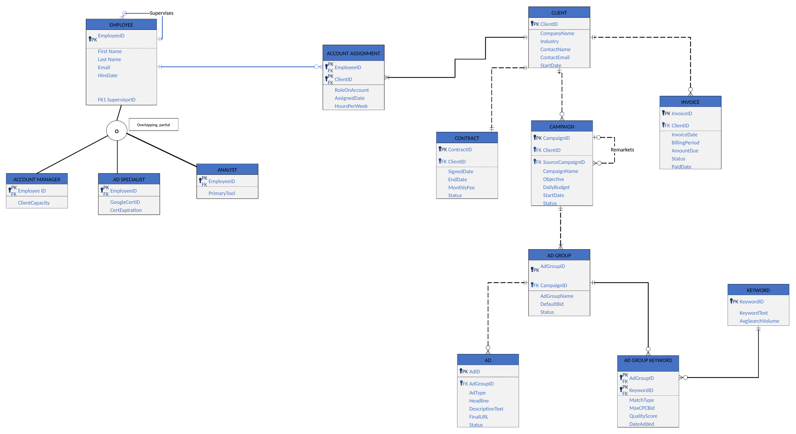

# Google Ads Agency Database (MySQL)

**A relational database that brings a digital marketing agency's clients, contracts, Google Ads campaigns, staff assignments and billing into one system, plus 10 SQL queries that answer the questions management actually asks.**

Designed as an ERD in crow's foot notation, first built in Microsoft Access, then rebuilt in **MySQL** with full constraints so anyone can run it.

**[Read the full design report (PDF)](report/Google_Ads_Agency_Database_Report.pdf)**

---

## The business problem

Alamo Digital Marketing (a fictional agency) runs Google Ads campaigns for local businesses. Google Ads stores the ads themselves, but everything about running the agency lives in scattered spreadsheets and emails:

- Management can't see which employees handle which clients, or who is overloaded.
- Unpaid invoices are found late because billing isn't linked to client records.
- Contract terms aren't connected to the campaigns and budgets being run.
- When a remarketing campaign is built from an earlier campaign, the link isn't recorded.

This database mirrors the Google Ads hierarchy (**Client → Campaign → Ad Group → Ads and Keywords**) and adds the business records Google Ads doesn't track: **contracts, staff assignments and invoices**.

## Entity-relationship diagram



**13 entities, covering every major relationship type:**

| Relationship type | Where it appears |
|---|---|
| One-to-one (1:1) | CLIENT – CONTRACT, enforced with a UNIQUE foreign key |
| One-to-many (1:M) | Client → Campaign → Ad Group → Ad; Client → Invoice |
| Many-to-many, resolved | AD GROUP ↔ KEYWORD via `ADGROUPKEYWORD`; EMPLOYEE ↔ CLIENT via `ACCOUNTASSIGNMENT` |
| Unary (self-referencing) | Employee *supervises* Employee; Campaign *remarkets* Campaign |
| Supertype / subtype | EMPLOYEE → Account Manager, Ad Specialist, Analyst (overlapping, partial) |

## The 10 business queries

All in [`sql/03_queries.sql`](sql/03_queries.sql).

| # | Business question | SQL concepts |
|---|---|---|
| F1 | What are every client's contract terms? | JOIN (1:1) |
| F2 | Which clients owe money, and how much? | JOIN, `IN`, `SUM`, `GROUP BY` |
| F3 | How do daily budgets compare across clients? | JOIN, `AVG`, `GROUP BY` |
| F4 | Which ad groups have weak keyword quality? | 3-table JOIN through an associative entity, `COUNT`, `AVG` |
| F5 | What is the highest bid in each campaign? | 4-table JOIN, `MAX` |
| F6 | Who reports to whom? | Self-join, `LEFT JOIN`, `COALESCE` |
| F7 | Whose Google Ads certification expires soonest? | Supertype/subtype JOIN, `DATEDIFF` |
| F8 | How many accounts is each employee carrying? | `LEFT JOIN` so employees with zero accounts still appear, `COUNT`, `SUM` |
| F9 | What ads are running in a given campaign? | 3-level hierarchy JOIN, parameter variable |
| F10 | Which remarketing campaigns came from which originals? | Self-join |

**Example: F2, unpaid billing by client**

```sql
SELECT  c.CompanyName,
        COUNT(i.InvoiceID) AS OpenInvoices,
        SUM(i.AmountDue)   AS TotalUnpaid
FROM    CLIENT  c
JOIN    INVOICE i ON i.ClientID = c.ClientID
WHERE   i.Status IN ('Unpaid', 'Overdue')
GROUP BY c.ClientID, c.CompanyName
ORDER BY TotalUnpaid DESC;
```

| CompanyName | OpenInvoices | TotalUnpaid |
|---|---|---|
| Cool Breeze AC and Heating | 2 | 3600.00 |
| Alamo Family Law | 1 | 2200.00 |
| Hill Country Roofing | 1 | 1250.00 |
| River Walk Auto Detail | 1 | 900.00 |
| Tres Leches Bakery | 1 | 750.00 |

## Data integrity

Business rules are enforced by the database itself, not left to whoever enters the data:

- **Primary and foreign keys** on every table, including composite keys on both associative entities.
- **UNIQUE** constraints: one contract per client, unique employee emails, cert IDs and keywords.
- **CHECK** constraints: Google quality score 1–10, positive budgets, bids and fees, contract end date after signed date, and allowed status values.
- **Defaults**: new contracts start `Active`, campaigns `Enabled`, invoices `Unpaid`.

[`sql/04_integrity_tests.sql`](sql/04_integrity_tests.sql) tries five invalid inserts, such as a second contract for the same client or a quality score of 11. The database correctly rejects every one.

## How to run it

Requires **MySQL 8.0+** (MySQL Workbench works too).

```bash
mysql -u root -p < sql/01_schema.sql        # creates the database and 13 tables
mysql -u root -p < sql/02_sample_data.sql   # loads the sample data
mysql -u root -p < sql/03_queries.sql       # runs the 10 business queries
```

In **MySQL Workbench**, open each file in order and click the lightning bolt to run it.

## Repository contents

```
sql/
  01_schema.sql            CREATE TABLE statements with all constraints
  02_sample_data.sql       Sample data exported from the Access database
  03_queries.sql           The 10 business queries (F1–F10)
  04_integrity_tests.sql   Invalid inserts that prove the constraints work
images/erd.png             ERD (crow's foot notation)
report/                    Full design report: business rules, data dictionary, query specs
original/                  Original Microsoft Access database and Visio ERD
scripts/                   Python script used to export the Access data to MySQL
```

## Tools

MySQL · SQL · Microsoft Access · Microsoft Visio (crow's foot ERD) · Python

## Author

**Victoria Reyna**, B.A. Multidisciplinary Studies (Applied Data Science), University of Texas at San Antonio

*Built for IS 3063 (Database Management for Information Systems). All company, client and employee data is fictional.*
